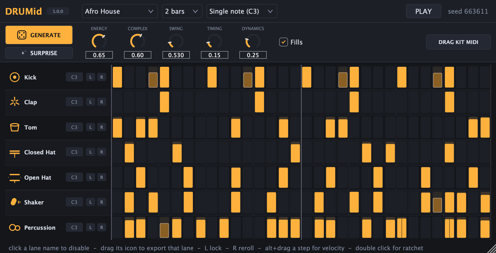

# DRUMid

MIDI drum pattern generator for **melodic house**, **organic house** and **techno**,
built for Ableton Live and Drum Racks.

Pick your lanes, hit GENERATE, drag the MIDI into a clip. No sound of its own —
DRUMid drives your rack.

---

## Status

Phase 1 (vertical slice) — plugin loads, generates, plays in sync and exports.

| | |
|---|---|
| Formats | VST3, Standalone (universal binary: arm64 + x86_64) |
| Lanes | Kick, Clap, Tom, Closed Hat, Open Hat, Shaker, Percussion |
| Genres | Organic House, Afro House, Indie Dance, Melodic House, Melodic Techno, Techno |
| Seed bank | 137 curated patterns |
| Pattern length | 1, 2 or 4 bars |



AU is wired up in `CMakeLists.txt` but off by default because it needs a full
Xcode install (Command Line Tools alone won't build it). With Xcode present:

```bash
cmake -B build -DCMAKE_BUILD_TYPE=Release -DDRUMID_BUILD_AU=ON
```

## Build

```bash
cmake -B build -DCMAKE_BUILD_TYPE=Release && cmake --build build -j8
```

JUCE 8.0.9 is pulled in automatically by CMake. The VST3 is copied to
`~/Library/Audio/Plug-Ins/VST3/` on every build.

## Tests

```bash
cmake -B build -DCMAKE_BUILD_TYPE=Release -DDRUMID_BUILD_TESTS=ON
cmake --build build --target DrumidTests -j8
./build/DrumidTests_artefacts/Release/DrumidTests
```

Prints the generated grids for all three genres and asserts the things that are
hard to hear a bug in: the kick lands on the quarters, techno's hat stays off
the downbeat, bar 2 isn't a copy of bar 1, swing is real micro-timing, a locked
lane survives GENERATE, a seed is reproducible, and the exported .mid contains
every hit on the right pad at exactly the right clip length.

## Using it in Ableton

**One instrument per track (the default workflow):** every lane sits on C3, and
dragging `DRAG KIT MIDI` into the Session View writes one MIDI track per lane —
Ableton creates a track per instrument, already named Kick, Clap, Tom and so on.
Drag a single lane's **icon** to export just that lane.

**Driving a Drum Rack instead:** switch the map to GM / Drum Rack. Now each lane
has its own note and the kit drag writes one track, so it lands as a single clip
that plays the whole rack.

Either way, swing and humanize are baked into the exported timing — what you
drag is what you heard.

**To audition live:** DRUMid is an instrument that outputs MIDI, so it goes on
its own MIDI track. On the Drum Rack track set `MIDI From` → the DRUMid track →
`DRUMid`, and `Monitor: In`.

## Note mapping

Two workflows, two answers.

Driving **one Simpler per track**, the routing separates the instruments and the
note carries no information — so every lane sits on the same note and the export
splits by track instead. That is the default.

Driving a **Drum Rack**, the note *is* what separates the instruments, and the
pattern is only useful if it fires the right pad.

- **Single note (C3)** *(default)* — every lane on note 60, the root Simpler and
  Sampler default to. The kit drag automatically becomes one track per lane,
  because a flat export would stack all seven on one voice.
- **GM / Drum Rack** — 36 kick, 39 clap, 45 tom, 42 closed hat, 46 open hat,
  70 shaker, 63 conga. Matches Ableton's factory racks.
- **Drum Rack 4x4** — C1 upward, chromatic, one pad per lane. For racks laid out
  by pad position.
- **Custom** — drag any lane's note readout up or down.

## The pattern brain

Three layers, because a pure random generator sounds random and a pure library
gets repetitive:

1. **Curated seeds** (`Engine/PatternLibrary.cpp`) — genre-specific patterns with
   velocity and articulation already in them. Energy gates which seeds are even
   eligible, so turning it up reaches for busier material instead of sprinkling
   random hits on a sparse pattern.
2. **Compatibility rules** (`Engine/Generator.cpp`) — lanes generate in dependency
   order and react to each other. Open hats move off the kick instead of getting
   masked by it; hats duck under the kick and the clap; percussion is displaced
   into the gaps between kicks, hard in organic house, not at all in melodic.
   In techno the closed hat is kept off the downbeat, because the offbeat-only
   placement *is* the genre.

   The tom is the interesting one. A tom hitting *with* the kick is normal —
   the tribal downbeat tom, a fill running through the beat, techno's rolling
   8th tom whose hits land on kicks by definition. Only a long low tom on every
   kick, in a genre where the kick carries the sub, actually causes a problem,
   so the rule is narrow instead of blanket. An earlier blanket version turned
   techno's rolling tom from 8 hits a bar into 4, which is why there is now a
   test pinning it.
3. **Variation** — swing as real micro-timing, humanize, probability on ghost
   notes, 32nd ratchets, bar-to-bar mutation so 2 and 4 bar patterns don't read
   as a 1-bar loop, and end-of-phrase fills.

Energy is a **shared budget across the kit**, not a per-lane setting. Without
that, every colour lane independently answers "how busy should I be?" and at
seven lanes the honest answer from each one adds up to mud. Kick and clap are
the skeleton and are never touched; the rest compete for one budget.

Who gives ground is decided per genre, not by who happens to be busiest. The
hi-hat is naturally the densest lane, so thinning the busiest starved the congas
in afro house — exactly backwards, since there the percussion is the lead voice
and the hat is what should step back. Each lane now carries a per-genre
importance, and the lane that is most over-represented relative to it gives up
its quietest hit first. In afro house that lands around 14 conga hits to 7 hat;
in techno it inverts to 13 hat against 8 percussion.

Everything is driven by the seed number, so the same seed rebuilds the same kit.
That is what makes **lock + reroll** work: keep the kick you liked, hit GENERATE,
and only the unlocked lanes change.

### What each genre actually knows

- **Melodic house** — open hat on the 8th-note offbeats, 16th hats with the
  offbeat accent, light swing, ghost pickups into the bar.
- **Organic house** — hand percussion carries it: tresillo, son clave 3-2, rumba
  clave 3-2, E(5,16) and E(7,16). Clap often only on 4. Heavier swing and much
  wider velocity spread, which is what makes it sound played rather than
  programmed.
- **Techno** — straight, zero swing, closed hat on the offbeat, sparse
  syncopated metal placed between the kicks, 32nd ratchet rolls into the phrase.

## The two buttons

**GENERATE** rerolls the patterns under the settings you chose. **SURPRISE**
rerolls the settings too — genre, energy, complexity and feel — and then
generates. Locked lanes and the bar count survive both: a lock is a promise, and
pattern length is a structural decision rather than a flavour.

## Editing the grid

| | |
|---|---|
| click / drag | paint steps on and off |
| alt + drag | velocity |
| double click | cycle ratchet (1 → 2 → 3) |
| lane name | enable / disable the lane |
| drag the lane icon | export that lane alone as MIDI |
| `L` | lock — GENERATE will not touch this lane |
| `R` | reroll just this lane |
| drag the note | retune the lane (switches the map to Custom) |

There is no mute or solo. Every lane drives its own instrument, so enable/disable
is the only switch that means anything here — a muted-but-still-generated lane is
just a lane you forgot to turn back on.

Step blocks are drawn shifted by their real micro-timing, so swing and humanize
are visible and not just audible.

## Previews

`docs/` holds a rendered screenshot per genre. They come from the offscreen
renderer, not a screen capture:

```bash
cmake -B build -DCMAKE_BUILD_TYPE=Release -DDRUMID_BUILD_PREVIEW=ON
cmake --build build --target DrumidPreview -j8
./build/DrumidPreview_artefacts/Release/DrumidPreview docs
```

## Layout

```
Source/
  PluginProcessor.*     kit state, double-buffered to the audio thread
  PluginEditor.*        UI, MIDI drag-out tiles
  Engine/
    Types.h             Step / LanePattern / Kit / GenSettings
    PatternLibrary.*    the curated seed bank
    Generator.*         the three-layer brain + Euclidean rhythms
    NoteMap.*           GM / 4x4 / Custom lane mapping
    Sequencer.*         PPQ-locked, sample-accurate playback
    MidiExport.*        kit or single lane to .mid
  UI/
    StepGrid.*          lane headers + step grid
    Icons.*             vector lane glyphs
    DrumidLookAndFeel.*
Tools/
  PreviewRender.cpp     renders the editor to PNG with no window
```

## Not there yet

- More lanes: snare, ghost snare, rim, ride, crash, tambourine, FX
- The shaker and the percussion lane can still land on near-identical rhythms
- Host-automatable parameters (state saves and recalls, but nothing is automatable yet)
- Preset browser
- Pattern-length-per-lane (polymeter)
- AU build, pending a full Xcode install

## Licence

Uses [JUCE](https://juce.com) 8, which is GPL3 for open source and requires a
paid licence for closed-source distribution. Licence for DRUMid itself: TBD.
